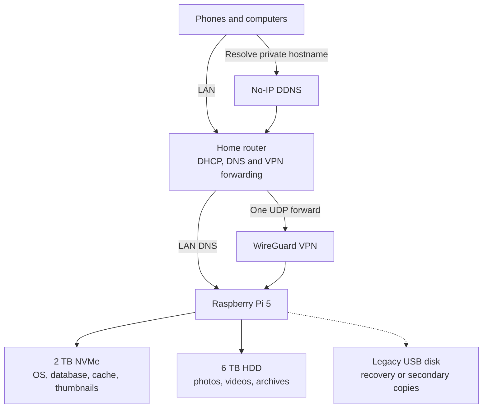

# Raspberry Pi 5 Home Cloud

A self-hosted private cloud built on a Raspberry Pi 5 with NVMe boot, tiered
storage, private remote access, photo backup, network-wide DNS filtering, file
sharing, 3D-printer management, and living-room emulation/media tools.

The project consolidates several previously independent services into one
maintainable system while keeping large media on dedicated storage and
latency-sensitive application data on NVMe.

> This public version is intentionally sanitized. IP addresses, usernames,
> device serials, filesystem UUIDs, WireGuard keys, passwords, personal folder
> names, and other identifying values are not included.

## What it runs

| Capability | Service | Role |
| --- | --- | --- |
| Photo cloud | Immich | Automatic mobile backup, timeline, search, faces and albums |
| DNS filtering | Pi-hole | Network-wide ad and tracker blocking |
| Recursive DNS | Unbound | Private recursive resolution for Pi-hole |
| Dynamic DNS | No-IP DUC | Keeps a private hostname pointed at the home connection |
| Remote access | WireGuard | Encrypted access without exposing applications publicly |
| Browser file access | File Browser | Web interface for approved storage roots |
| LAN file access | Samba | Authenticated SMB shares |
| 3D printing | OctoPrint | Remote printer monitoring and control |
| Media center | Kodi | Local media playback |
| Emulation | RetroPie / EmulationStation | Local game launcher |
| Containers | Docker Compose | Immich application stack |

## Architecture



The NVMe drive hosts the operating system, PostgreSQL, Docker data, machine
learning cache and generated thumbnails. Original Immich uploads live on the
larger ext4 library disk. Existing archives can be mounted read-only inside
Immich as external libraries.

## Engineering highlights

- Migrated a running Raspberry Pi OS installation from SD card to NVMe.
- Updated and validated the Raspberry Pi bootloader for direct NVMe boot.
- Migrated roughly 600 GB with metadata-preserving `rsync`, followed by both
  reconciliation and checksum verification passes.
- Designed mount dependencies so Docker cannot start Immich before the media
  filesystem is available.
- Split Immich originals and high-I/O working data across HDD and NVMe.
- Configured router DHCP to advertise Pi-hole as LAN DNS, with Unbound as its
  recursive resolver.
- Combined No-IP dynamic DNS with WireGuard for stable, encrypted remote access.
- Restricted File Browser to an explicit root instead of exposing `/`.
- Used read-only container mounts for archived external photo libraries.
- Diagnosed USB Attached SCSI timeouts and applied a device-specific
  `usb-storage` fallback.
- Detected and corrected a Pi 5 PWM-fan initialization issue.
- Used service, HTTP, DNS, VPN, filesystem and SMART checks for validation.
- Added zram/loopback swap protection and an image-based system recovery plan.
- Identified a degraded legacy disk during the final operational audit.

## Repository map

```text
.
├── configs/
│   ├── boot/
│   ├── immich/
│   ├── noip/
│   ├── samba/
│   ├── storage/
│   ├── systemd/
│   └── wireguard/
├── docs/
│   ├── ARCHITECTURE.md
│   ├── BUILD_LOG.md
│   ├── MEDIA_AND_EMULATION.md
│   ├── OPERATIONS.md
│   ├── PORTFOLIO_SUMMARY.md
│   ├── PUBLISHING.md
│   ├── REMOTE_ACCESS.md
│   ├── SECURITY.md
│   ├── SERVICE_INVENTORY.md
│   ├── SYSTEM_RESILIENCE.md
│   └── TROUBLESHOOTING.md
└── scripts/
    ├── health-check.sh
    ├── sanitize-check.sh
    └── verify-migration.sh
```

## Quick validation

Run the non-destructive health audit:

```bash
sudo ./scripts/health-check.sh
```

Before publishing any local changes:

```bash
./scripts/sanitize-check.sh
```

## Documentation

- [Architecture](docs/ARCHITECTURE.md)
- [Build log](docs/BUILD_LOG.md)
- [Kodi and RetroPie media console](docs/MEDIA_AND_EMULATION.md)
- [Operations runbook](docs/OPERATIONS.md)
- [Router, DDNS and VPN](docs/REMOTE_ACCESS.md)
- [Complete service inventory](docs/SERVICE_INVENTORY.md)
- [Swap, backup and recovery](docs/SYSTEM_RESILIENCE.md)
- [Security model](docs/SECURITY.md)
- [Troubleshooting notes](docs/TROUBLESHOOTING.md)
- [Portfolio summary](docs/PORTFOLIO_SUMMARY.md)
- [Publishing checklist](docs/PUBLISHING.md)

## Project status

The core platform is operational. Immich, Docker, Pi-hole, Unbound, No-IP,
WireGuard, Samba, File Browser and OctoPrint have passed functional checks.
Kodi and EmulationStation launch correctly with hardware graphics acceleration.

A legacy USB disk was flagged by SMART as degraded and is excluded from the
trusted storage design pending recovery and replacement.

## Upstream projects

- [Raspberry Pi documentation](https://www.raspberrypi.com/documentation/)
- [Immich documentation](https://docs.immich.app/)
- [Docker Engine documentation](https://docs.docker.com/engine/)
- [Pi-hole documentation](https://docs.pi-hole.net/)
- [Unbound documentation](https://unbound.docs.nlnetlabs.nl/)
- [No-IP Linux DUC documentation](https://www.noip.com/support/knowledgebase/install-linux-3-x-dynamic-update-client-duc)
- [WireGuard documentation](https://www.wireguard.com/quickstart/)
- [File Browser documentation](https://filebrowser.org/)
- [OctoPrint documentation](https://docs.octoprint.org/)
- [Kodi Wiki](https://kodi.wiki/)
- [RetroPie documentation](https://retropie.org.uk/docs/)

## License

MIT. See [LICENSE](LICENSE).
