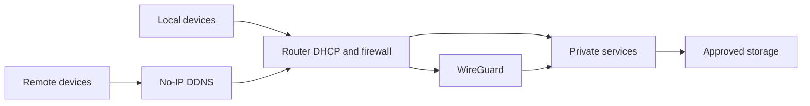

# Architecture

## Design goals

1. Boot and run databases from fast, resilient NVMe storage.
2. Keep large original photos and videos on a high-capacity ext4 disk.
3. Avoid exposing private services directly to the public internet.
4. Keep existing archives immutable until migration and ownership are verified.
5. Allow browser and SMB access without exposing the full Linux filesystem.
6. Make storage failures visible through repeatable health checks.
7. Make Pi-hole the router-advertised DNS service without creating a public
   resolver.
8. Use DDNS and one VPN entry point instead of exposing application ports.

## Storage tiers

| Tier | Example mount | Workload |
| --- | --- | --- |
| NVMe system tier | `/` | OS, Docker, PostgreSQL, caches and application state |
| Media tier | `/srv/immich-library` | Immich originals, database dumps and archives |
| Web file root | `/srv/filebrowser` | Approved folders and bind-mounted storage |
| Legacy/recovery tier | `/mnt/legacy-usb` | Temporary access to old disks; not trusted |

### Immich placement

```text
/srv/immich-library/
├── immich-managed/
│   ├── library/           # Uploaded originals
│   ├── encoded-video/     # Generated video variants
│   ├── profile/
│   └── backups/           # Database dumps; not media backups
└── import-staging/        # Existing archive, mounted read-only

/srv/immich-data/
├── postgres/              # NVMe
└── thumbs/                # NVMe
```

The Immich server sees:

| Host path | Container path | Mode |
| --- | --- | --- |
| `/srv/immich-library/immich-managed` | `/data` | read/write |
| `/srv/immich-data/thumbs` | `/data/thumbs` | read/write |
| `/srv/immich-library/import-staging` | `/external/archive` | read-only |

## Service dependency design

Docker is configured with:

```ini
[Unit]
RequiresMountsFor=/srv/immich-library
```

This prevents a dangerous failure mode where Docker starts while the external
disk is absent and silently writes media into an empty directory on the root
filesystem.

## Access model



- LAN clients connect directly to private service addresses.
- Router DHCP advertises Pi-hole as the DNS server for LAN clients.
- Pi-hole forwards uncached queries to the local Unbound resolver.
- No-IP tracks the changing public address without exposing any application.
- Remote clients enter through a single WireGuard UDP port forward.
- No Immich, File Browser, OctoPrint or SMB port needs public forwarding.
- File Browser is rooted at `/srv/filebrowser`, not `/`.
- Existing photo archives are mounted read-only inside Immich.

## Data ownership

Immich users receive separate storage labels, producing a layout such as:

```text
library/UserA/2026/2026-07-29/photo.jpg
library/UserB/2026/2026-07-29/photo.jpg
```

External libraries are created separately for each owner because Immich library
ownership cannot be changed after creation.

## Backup boundaries

An Immich database dump contains metadata and relationships, not the original
media. A recoverable backup requires both:

1. PostgreSQL/database dumps and configuration.
2. A separate copy of the complete Immich media directory.

The legacy USB disk in this build is not considered a valid backup target after
SMART reported unreadable sectors.

## Service inventory

| Layer | Components |
| --- | --- |
| Base system | Raspberry Pi OS, NVMe boot, SSH, systemd |
| Network | Router DHCP/DNS, Pi-hole, Unbound, No-IP, WireGuard |
| Storage | ext4 media disk, bind mounts, Samba, File Browser |
| Cloud application | Docker, Compose, Immich, PostgreSQL, Valkey, machine learning |
| Devices and media | OctoPrint, Kodi, RetroPie, EmulationStation |
| Reliability | zram, fallback swap, PWM cooling, SMART checks, system image |
