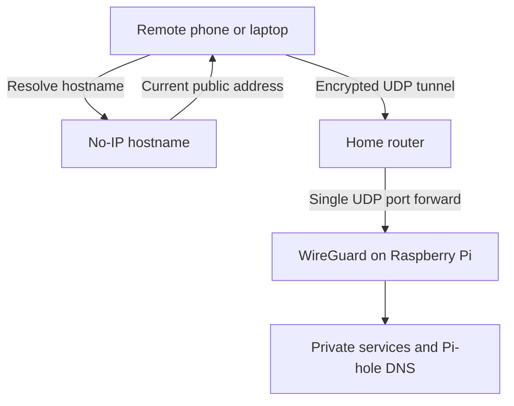

# Router, DDNS and VPN

This layer makes private services reachable away from home without publishing
their web interfaces directly to the internet. All addresses, hostnames, ports,
keys and peer identities in this repository are placeholders.

## Traffic design



No-IP updates DNS when the home public address changes; it is not an
application proxy and does not carry the VPN traffic. The router forwards one
UDP port to the Raspberry Pi's reserved LAN address. Immich, File Browser,
OctoPrint, Samba, Pi-hole and Unbound are not directly forwarded.

## Router configuration

Router interfaces vary, but the required intent is consistent:

1. Reserve a stable LAN address for the Raspberry Pi in DHCP.
2. Set the router's LAN/DHCP DNS server to the Pi-hole address.
3. Remove secondary public DNS values if the router allows clients to bypass
   Pi-hole through them.
4. Review IPv6 router advertisements and DHCPv6 DNS. Either advertise Pi-hole's
   stable IPv6 address or disable the conflicting DNS advertisement.
5. Forward `<WIREGUARD_UDP_PORT>/UDP` to the Pi's reserved LAN address.
6. Do not create forwards for web, DNS, SMB or application ports.
7. Renew a client DHCP lease and confirm that the client received Pi-hole DNS.

Changing the router's WAN/upstream DNS is not the same as changing LAN DHCP
DNS. The goal is for clients to query Pi-hole directly so that per-client
reporting and filtering work as intended.

## Pi-hole and Unbound flow


Validate both layers independently:

```bash
dig @<PIHOLE_ADDRESS> example.com +short
dig @<PIHOLE_ADDRESS> -p <UNBOUND_PORT> example.com +short
```

## No-IP DUC

The No-IP Dynamic Update Client runs as a systemd service and updates only the
private hostname configured on the host:

```bash
systemctl status noip-duc --no-pager
sudo journalctl -u noip-duc --since today --no-pager
dig +short <DDNS_HOSTNAME>
```

Credentials and the real hostname belong in `/etc/default/noip-duc`, never in
Git. See `configs/noip/noip-duc.default.example`.

## WireGuard server

The server uses one interface and a separate peer entry per device. See
`configs/wireguard/wg0.conf.example`.

```bash
systemctl status wg-quick@wg0 --no-pager
sudo wg show
```

`active (exited)` is normal for `wg-quick`: the setup command completed while
the configured kernel interface remains active. A current handshake and
increasing transfer counters confirm a working peer.

## Client routing choices

The sample client is split tunnel:

- Home LAN and VPN network traffic enter WireGuard.
- Normal internet traffic continues through the client's current connection.
- DNS points to Pi-hole through the tunnel.

For a full tunnel, use `AllowedIPs = 0.0.0.0/0, ::/0` and configure forwarding
and NAT on the server. Full tunnel mode should be an intentional choice because
it sends all client traffic through the home connection.

`PersistentKeepalive = 25` is useful for a roaming client behind NAT. It is not
required for every peer.

## Safe validation

Test from mobile data or another network:

1. Confirm the No-IP hostname resolves to the current home public address.
2. Activate WireGuard and confirm a recent handshake.
3. Query Pi-hole through the tunnel.
4. Open one private service using its LAN/VPN address.
5. Confirm the same service is unreachable from the public internet with the
   VPN disabled.

Never publish the real hostname, public endpoint, keys, preshared keys, peer
public keys, internal subnet plan or full `wg show` output.

